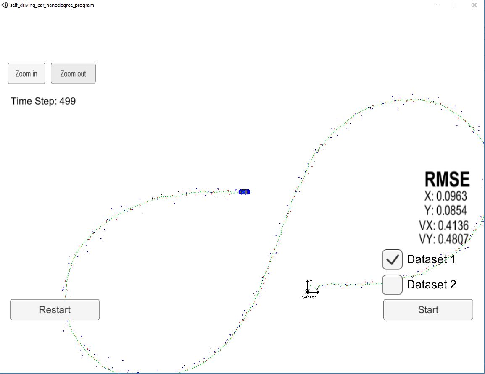

# Extended Kalman Filter Project 
Self-Driving Car Engineer Nanodegree Program

## Introduction

This project utilizes a kalman filter to estimate the state of a moving object of interest with noisy lidar and radar measurements.

We're provided simulated lidar and radar measurements detecting a bicycle that travels around the vehicle. We will use a Kalman filter, lidar measurements and radar measurements to track the bicycle's position and velocity.

Lidar measurements are red circles, radar measurements are blue circles with an arrow pointing in the direction of the observed angle, and estimation markers are green triangles. The video [here](https://www.youtube.com/watch?time_continue=5&v=d6qbR3_LPoA) shows what the simulator looks like when a c++ script is using its Kalman filter to track the object. The simulator provides the script the [measured data (either lidar or radar)](https://github.com/rakeshch/CarND-Extended-Kalman-Filter/blob/master/data/obj_pose-laser-radar-synthetic-input.txt), and the script feeds back the measured estimation marker, and RMSE values from its Kalman filter.

Passing the project requires px, py, vx, and vy RMSE should be less than or equal to the values [.11, .11, 0.52, 0.52]. 

This project involves the Term 2 Simulator which can be downloaded [here](https://github.com/udacity/self-driving-car-sim/releases)

This repository includes two files that can be used to set up and install [uWebSocketIO](https://github.com/uWebSockets/uWebSockets) for either Linux or Mac systems. For windows you can use either Docker, VMware, or even [Windows 10 Bash on Ubuntu](https://www.howtogeek.com/249966/how-to-install-and-use-the-linux-bash-shell-on-windows-10/) to install uWebSocketIO. 

Once the install for uWebSocketIO is complete, the main program can be built and run by doing the following from the project top directory.

1. mkdir build
2. cd build
3. cmake ..
4. make
5. ./ExtendedKF

Note that the programs that need to be written to accomplish the project are src/FusionEKF.cpp, src/FusionEKF.h, kalman_filter.cpp, kalman_filter.h, tools.cpp, and tools.h

Here is the main protocol that main.cpp uses for uWebSocketIO in communicating with the simulator.

INPUT: values provided by the simulator to the c++ program

["sensor_measurement"] => the measurement that the simulator observed (either lidar or radar)

OUTPUT: values provided by the c++ program to the simulator

["estimate_x"] <= kalman filter estimated position x
["estimate_y"] <= kalman filter estimated position y
["rmse_x"]
["rmse_y"]
["rmse_vx"]
["rmse_vy"]

---

## Other Important Dependencies

* cmake >= 3.5
  * All OSes: [click here for installation instructions](https://cmake.org/install/)
* make >= 4.1 (Linux, Mac), 3.81 (Windows)
  * Linux: make is installed by default on most Linux distros
  * Mac: [install Xcode command line tools to get make](https://developer.apple.com/xcode/features/)
  * Windows: [Click here for installation instructions](http://gnuwin32.sourceforge.net/packages/make.htm)
* gcc/g++ >= 5.4
  * Linux: gcc / g++ is installed by default on most Linux distros
  * Mac: same deal as make - [install Xcode command line tools](https://developer.apple.com/xcode/features/)
  * Windows: recommend using [MinGW](http://www.mingw.org/)

## Basic Build Instructions

1. Clone this repo.
2. Make a build directory: `mkdir build && cd build`
3. Compile: `cmake .. && make` 
   * On windows, you may need to run: `cmake .. -G "Unix Makefiles" && make`
4. Run it: `./ExtendedKF `

## Editor Settings

We've purposefully kept editor configuration files out of this repo in order to
keep it as simple and environment agnostic as possible. However, we recommend
using the following settings:

* indent using spaces
* set tab width to 2 spaces (keeps the matrices in source code aligned)

## Code Style

Please (do your best to) stick to [Google's C++ style guide](https://google.github.io/styleguide/cppguide.html).

## Generating Additional Data

This is optional!

If you'd like to generate your own radar and lidar data, see the
[utilities repo](https://github.com/udacity/CarND-Mercedes-SF-Utilities) for
Matlab scripts that can generate additional data.

## RMSE (Root Mean Square Error)
The final values can be seen from the screen below:

## Helpful Reads

This [blog](http://www.bzarg.com/p/how-a-kalman-filter-works-in-pictures/) does a very good job of explaining the math behind kalman filter, particularly concerning the derivation of Kalman gain K.

This [article](http://bilgin.esme.org/BitsAndBytes/KalmanFilterforDummies) illustrates how to use kalman filter to resolve an estimation problem, using a kalman filter for that problem may be an overkill, but I find it very enlightening in terms of understanding how the kalman works.
